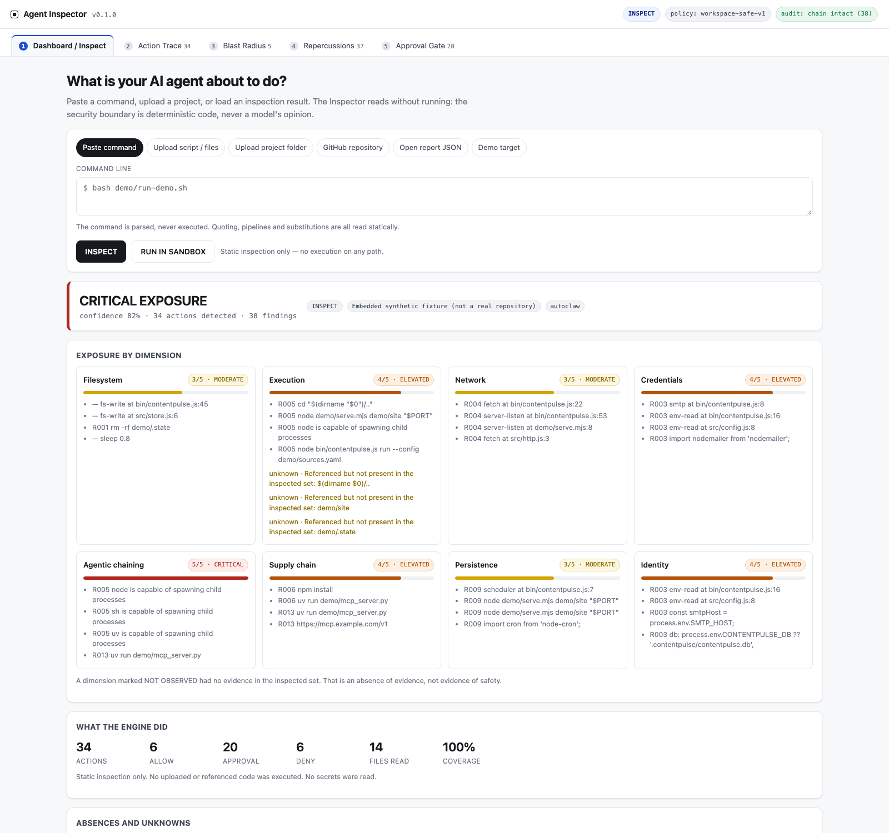
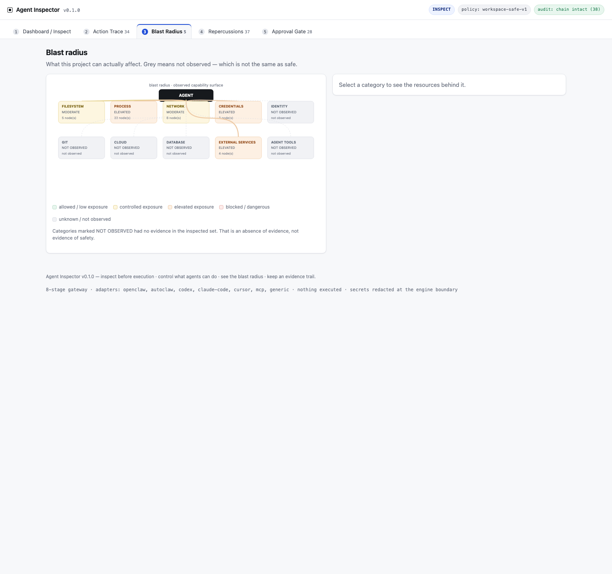
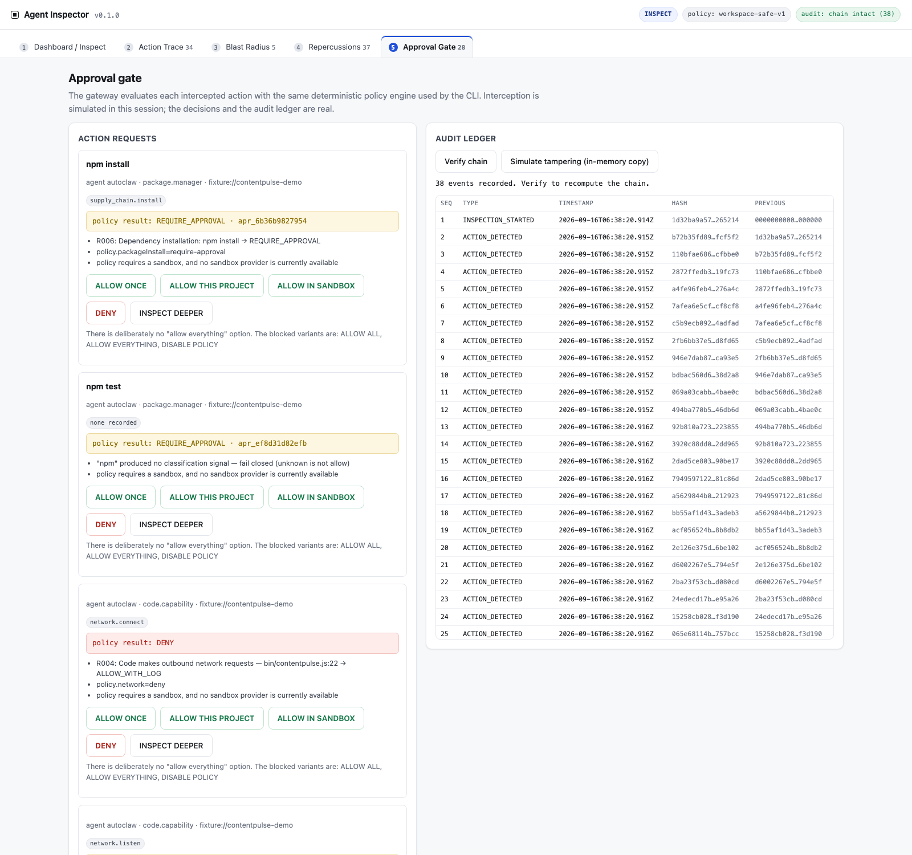
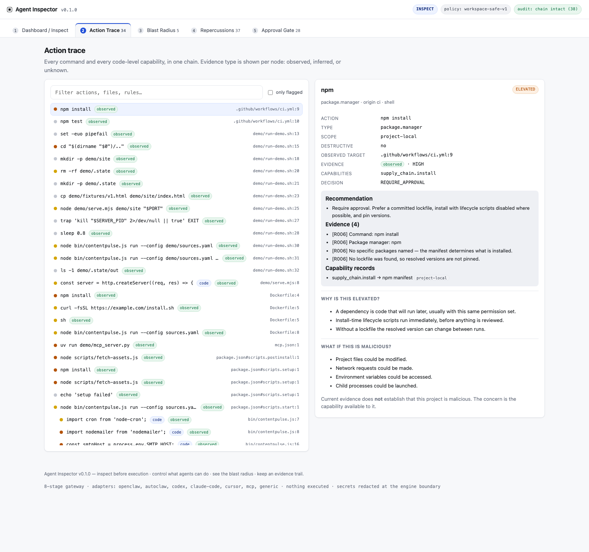
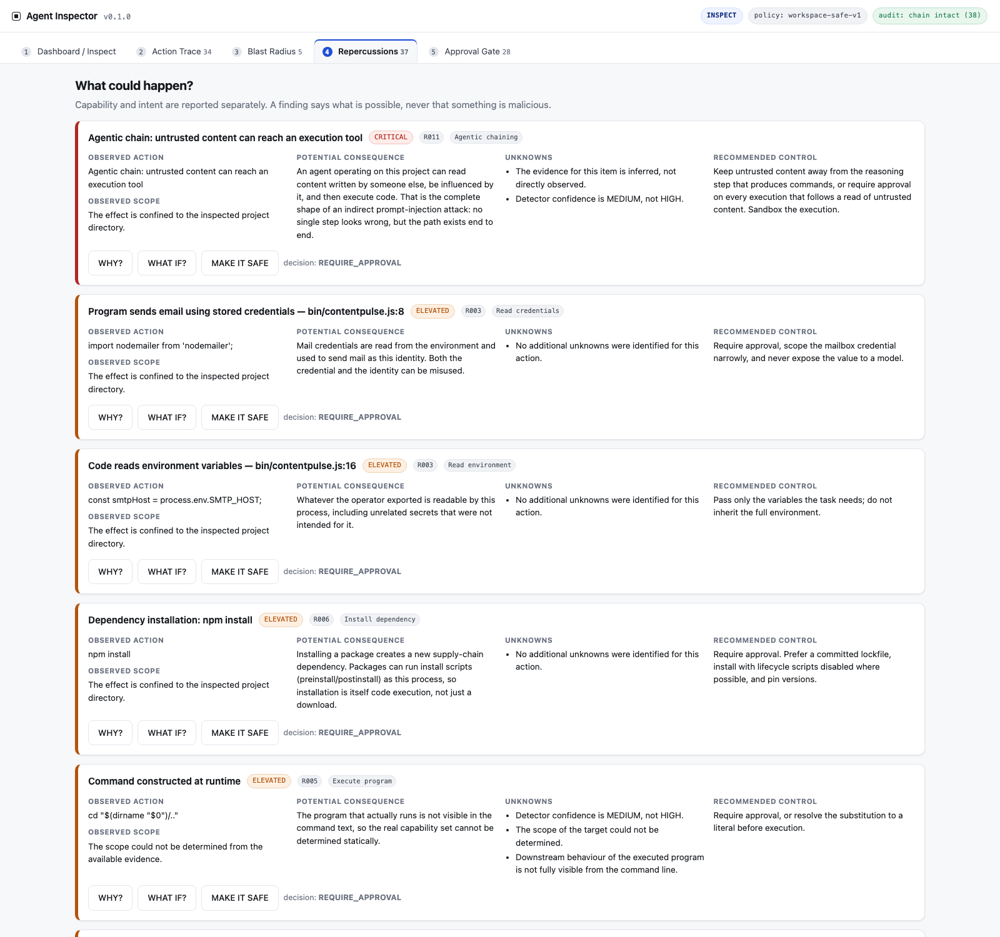

# Agent Inspector

**The security gateway for autonomous AI agents.**

> Inspect before execution. Control what agents can do. See the blast radius. Approve with confidence. Keep an evidence trail.

Agent Inspector sits between a human builder and autonomous agents (OpenClaw, AutoClaw, Claude Code, Codex, Cursor, MCP-enabled agents). It answers one question:

> **What is this agent about to do, what can it affect, what could go wrong, and should I allow it?**

It runs in two modes:

| Mode | What it does | Status |
| --- | --- | --- |
| **INSPECT** | Reads commands, scripts, repositories, MCP configs, skills and agent configs **without executing anything**. | Implemented, end-to-end. |
| **GATEWAY** | Intercepts an agent action, evaluates it against policy, requires approval when needed, allows safe actions, blocks prohibited ones, records an immutable trail. | Policy engine + audit ledger are real and tested. Interception is exercised through the CLI (`gateway`) and the console's Approval Gate; wiring it to a live agent process is the remaining integration (see [Honest scope](#honest-scope)). |

---

## 1. The one rule everything follows

**An LLM explanation is never the security boundary.**

The engine is deterministic code. There is no model in the decision path anywhere in this repository. Every finding is produced by a named rule that a human can read, and every decision is a pure function of `(ActionRequest, policy, findings)`.

The intended LLM role — explaining a finding in plain language — is satisfied today by the `why`, `whatIf` and `whyItMatters` text that the rules themselves carry, which is the part an LLM would otherwise generate.

---

## 2. Quick start

No install step. No dependencies. Node 20+.

```bash
cd agent-inspector

# 1. Open the console (single self-contained file, no server needed)
open dist/agent-inspector.html

# 2. Inspect a real project on disk (read-only)
npm run inspect -- ../contentpulse

# 3. Inspect a single command
npm run inspect -- --command "node bin/contentpulse.js run --config demo/sources.yaml"

# 4. Evaluate one intercepted action like the runtime gateway does
echo '{"agent":"autoclaw","action":{"type":"process.execute","command":"node","args":["bin/app.js"]},"context":{"workspace":"/project/app","sandbox":true}}' | npm run gateway

# 5. Run the test suite (169 tests) and rebuild the console
npm test
```

Other entry points:

```bash
npm run inspect -- fixtures/spec-demo --format json --out report.json   # JSON report
npm run inspect -- --github snyk/agent-scan --max-files 60              # read-only public fetch
npm run adapters     # every agent's effective policy
npm run policy       # the bundled policies as YAML
npm run sandbox      # available sandbox providers
npm run serve        # dev server on http://127.0.0.1:8788 (loopback only)
npm run verify:bundle  # prove the console runs the same engine as the CLI
```

**The console** opens straight from disk: `dist/agent-inspector.html` inlines the stylesheet and the entire engine. There is no CDN, no build step for you to run, and no network access. `npm run serve` exists only for development, because ES modules cannot be loaded over `file://`.

It also accepts deep links, which is how the screenshots in `docs/screenshots/` were produced:

```
dist/agent-inspector.html?load=fixture                # load the synthetic fixture
dist/agent-inspector.html?load=report                 # load dist/fixture-report.json
dist/agent-inspector.html?load=fixture&screen=blast   # …and open a specific screen
```
`screen` accepts `dashboard`, `trace`, `blast`, `repercussions` or `gate`.

### What it looks like











---

## 3. The five screens

| Screen | Answers | What is real |
| --- | --- | --- |
| **1 · Dashboard / Inspect** | *What is your agent about to do?* | Real engine output. Paste a command, upload scripts or a folder, load a report JSON, or load the synthetic fixture. Exposure per dimension, with the evidence behind each score. |
| **2 · Action Trace** | *What exactly is the execution chain?* | Real parse of the shell text, plus code-level capabilities. Each node is clickable and shows action, type, scope, destructive, observed target, evidence type and confidence. Downstream edges follow static imports from an entrypoint to the modules it loads. |
| **3 · Blast Radius** | *What can this affect?* | Real capability records grouped into the ten categories. Grey means **not observed**, never "safe". |
| **4 · Repercussions** | *What could happen?* | Observed action, potential consequence, observed scope, unknowns and recommended control per finding, with `WHY?`, `WHAT IF?` and `MAKE IT SAFE` (policy patch). |
| **5 · Approval Gate** | *Should I allow it?* | Real policy evaluations per action, five approval actions (and deliberately no "allow everything"), plus the hash-chained ledger with a verify button and a tamper simulation that runs on an in-memory copy. |

There is also a runtime sandbox button that explains, rather than hides, the fail-closed behaviour: with no provider configured, nothing executes and it tells you why, plus the exact hardened `docker run` line it *would* use.

---

## 4. How the pipeline works

```
sources [{path, content}]
   │
   ├─ discovery            which artifact is this file? (agent config, MCP, skill, manifest, container, CI, code…)
   │
   ├─ extraction           shell parser · package.json scripts · Dockerfile RUN/CMD · Makefile · CI steps
   │                       · language capability scan (JS/TS/Python/PHP)  →  Actions
   │
   ├─ rule evaluation      R001–R013 over every action, R014 over manifests  →  findings + capabilities
   │
   ├─ agentic chaining     R011 over the whole graph (receive → interpret → generate → execute)
   │
   ├─ risk model           8 dimensions, each 0–5, each with evidence and an unknown list
   │
   ├─ repercussions        observed / consequence / scope / unknowns / control + WHY? / WHAT IF?
   │
   ├─ graphs               action graph · blast radius · dependency graph · static module graph
   │
   ├─ policy               one PolicyDecision per action (the only authorization outcome)
   │
   └─ audit                hash-chained ledger over the whole inspection, then verified
```

Everything is a pure function over an in-memory `sources` array. The same engine is used by the CLI, the tests and the browser bundle — `npm run verify:bundle` proves it by running both and comparing the results, including the audit hashes.

### Sources, not filesystems

The engine never touches a filesystem itself. Callers supply `[{path, content}]`:

- **CLI** reads a directory read-only (`scripts/lib/read-tree.mjs`): skips `node_modules`, `.git`, symlinks, binaries, files over 512 KB, and — deliberately — real `.env` files and key material.
- **Console** reads what you select in the file picker, in the browser.
- **GitHub** path fetches text over the API, never clones.

That is why the console can inspect your project without uploading it anywhere.

---

## 5. Rules

Deterministic, documented, tested. Each finding carries `rule, severity, evidence, scope, confidence, evidence_type, potential_consequence, recommended_control`.

| Rule | Detects | Default posture |
| --- | --- | --- |
| **R001** | Destructive filesystem (`rm -rf`, `unlink`, `shutil.rmtree`, `fs.rmSync`, truncating `>`) | project-local → MODERATE / approval · outside workspace → ELEVATED · root or home → CRITICAL / **deny** |
| **R002** | Privilege escalation (`sudo`, `doas`, `chmod 777`, `chown root`, `--privileged`, setuid) | CRITICAL / **deny** — not configurable to allow |
| **R003** | Credential access (`~/.ssh`, `~/.aws`, `.env`, keys, keychain, `process.env.SECRET*`, `printenv SMTP_PASS`) | ELEVATED / approval · values always `REDACTED` |
| **R004** | Network transmission (`curl`, `wget`, `fetch`, `requests`, webhooks, SMTP) with destination classification | localhost LOW · public MODERATE · private ELEVATED · unknown destination → approval |
| **R005** | Arbitrary code execution (interpreters, `-e`/`-c` inline code, `eval`, `child_process`, subshells, `curl \| bash`) | known+inspected entrypoint → allow-with-log · unreviewed → approval · inline/pipe → CRITICAL / **deny** |
| **R006** | Package installation (`npm i`, `pip install`, `npx`, `uv run`, `brew`, `cargo install`) | approval; escalates without a lockfile or for one-shot remote runners |
| **R007** | Git mutation (force push, `reset --hard`, `clean -fd`, `branch -D`) — read-only git stays ALLOW | force/destructive → CRITICAL · remote write → ELEVATED |
| **R008** | Cloud infrastructure (`aws`, `gcloud`, `terraform`, `kubectl`, `docker`…) classified read/write/delete/deploy/secret | read → allow-with-log · delete/deploy/secret → approval · privileged container → CRITICAL |
| **R009** | Persistence (`launchctl`, `systemctl enable`, `crontab`, `at`, `pm2`, background `&`) | persistent → CRITICAL / **deny** · background job → MODERATE |
| **R010** | Browser / SSRF (metadata endpoints, RFC1918, loopback-adjacent, browser automation) | metadata → CRITICAL / **deny** · private → ELEVATED |
| **R011** | Agent chaining — content in, execution out | MODERATE → CRITICAL as egress and credentials are added |
| **R012** | Prompt injection: instruction override, role hijack, guardrail removal, concealment, secret exfiltration, remote instructions, tool poisoning, hidden Unicode (zero-width / bidi / tags), long base64, instructions in HTML comments | ELEVATED/CRITICAL → approval; **content is never executed to test it** |
| **R013** | MCP inspection safety | static parse only, `SANDBOX_ONLY`, server **never** launched |
| **R014** | Dependency supply chain (git/URL deps, unpinned ranges, `postinstall` hooks, unpinned CI actions, `curl \| sh` in CI, floating base images, root containers) | states are `UNKNOWN` / `UNVERIFIED` / `SUSPICIOUS` / `KNOWN_VULNERABILITY` — never "malicious" |

`R014` is an extension beyond the spec's R001–R013 (the spec describes the analysis in §14 without assigning an id).

---

## 6. Policy engine and fail-closed

Every action becomes an `ActionRequest` (spec §8 shape) and is evaluated by one pure function. The five outcomes are the only ones that exist:

`ALLOW · ALLOW_WITH_LOG · REQUIRE_APPROVAL · SANDBOX_ONLY · DENY`

Decisions combine by taking the **strictest** — `DENY` beats everything.

Fail-closed is a first-class branch, not a default:

- an action that produces **no** classification signal → `REQUIRE_APPROVAL`, with the reason "unknown is not allow" (read-only commands are the one exception: `ALLOW_WITH_LOG`);
- destructive shapes with unknown scope → `DENY`;
- an analyzer that throws produces an `ENGINE` finding at ELEVATED and the action is not allowed.

Two bundled policies: `workspace-safe-v1` (default: no network, no persistence, no host credentials, sandbox required) and `developer-local-v1` (allowlisted domains and commands). Privilege escalation is `DENY` under both.

The approval ids are deterministic: the same action shape always yields the same `apr_…` id, so an approval cannot be silently widened.

---

## 7. Audit ledger

Every inspection and every decision appends to a hash chain: `hash = SHA256(seq, timestamp, type, agent, action, payload_hash, previous_hash)`. Payloads are deep-redacted **before** hashing, so a secret cannot enter the ledger even transiently.

```bash
npm run inspect -- ../contentpulse --format json --out report.json
node -e "const r=require('./report.json'); console.log(r.auditVerification, r.audit.head)"
```

The console shows the same ledger with a **Verify chain** button, and a **Simulate tampering** button that mutates a copy in memory so you can watch verification fail at the exact edited event (`payload was modified`).

SHA-256 and HMAC-SHA256 are implemented in `src/engine/crypto/sha256.js` with no dependencies, so the identical bytes are hashed in Node and in the browser. They are checked against `node:crypto` on every length boundary in `tests/crypto.test.js`.

---

## 8. Sandbox

```
SandboxProvider:  create() → execute() → inspect() → destroy()

NullSandboxProvider      default · refuses to execute · fail closed
PlanOnlySandboxProvider  returns the container plan and the exact argv, runs nothing
DockerSandboxProvider    hardened args; executes only with a runner AND explicit
                         authorization; not authorized by default
```

Hardening applied to every generated plan: `--network none`, `--read-only`, `--cap tmpfs noexec`, `--cap-drop ALL`, `--security-opt no-new-privileges`, `--memory`, `--cpus`, `--pids-limit`, workspace mounted `:ro`, non-root user.

The limitations are surfaced rather than hidden, in the UI and in `SANDBOX_LIMITATIONS`: *a sandbox reduces blast radius, it is not a complete security boundary.*

---

## 9. Adapters

One surface for every agent:

```js
inspectConfig() inspectSandbox() inspectToolPolicy() inspectElevatedPolicy()
inspectWorkspace() interceptAction() evaluateAction() recordDecision()
```

`openclaw`, `autoclaw`, `codex`, `claude-code`, `cursor`, `mcp`, `generic`.

Rules the adapters follow:

1. **An adapter never writes configuration.** There is no `writeConfig`, and `inspectConfig()` says so.
2. **Fixture mode is labelled.** A report from mock data is never presented as if it came from the real system.
3. **Live inspection needs consent.** `OpenClawAdapter.inspectLive(consent)` will only run `openclaw security`, `openclaw policy` and `openclaw sandbox explain --json` when a runner is injected *and* the user consents; it also shows you those commands first.

Agent Inspector is deliberately a **policy overlay** on OpenClaw's own controls (sandbox location, tool policy as the hard stop, elevated execution), not a replacement for them.

---

## 10. GitHub

- **GitHub App, least privilege, read-only:** `contents:read`, `metadata:read`, `pull_requests:read`, `issues:read`, `actions:read`. No write scope in the MVP, and `GITHUB_FORBIDDEN_PERMISSIONS` records what must not be requested.
- **Webhook validation:** `verifyWebhookSignature(rawBody, header, secret)` does HMAC-SHA256 over the raw bytes with a constant-time compare. Re-serialising the body breaks the check, which is asserted in the tests.
- **Repository inspection workflow:** connect → select → create inspection → (ephemeral sandbox clone, if at all) → static analysis → dependency analysis → agent config discovery → risk graph → report.
- **CLI fetch** (`inspect --github owner/repo`) is bounded, text-only and read-only: it lists the tree, prefers the security-relevant files, caps size and count, fetches in chunks of four, and reports rate-limit errors instead of looping.
- No repository is cloned into this application's runtime filesystem.
- Write access is gated behind an explicit `allowWrite` capability that the MVP never sets.

---

## 11. Database

`schema/postgres.sql` holds the §11 schema: `users`, `workspaces`, `agents`, `inspections`, `actions`, `capabilities`, `policies`, `decisions`, `audit_events`, plus indexes, a `v_findings` view, and a trigger that makes `audit_events` genuinely append-only.

The MVP does not require it: the same records live in the in-process ledger and serialise to the JSON report. The schema is the durable form for a Supabase deployment.

---

## 12. Testing and verification

```bash
npm test               # builds the console, then runs 169 tests
npm run verify:bundle  # proves the browser bundle runs the same engine
```

| Suite | Tests | Covers |
| --- | --- | --- |
| `crypto.test.js` | 9 | SHA-256/HMAC against `node:crypto` at every padding boundary; canonical JSON ordering; constant-time compare |
| `shell.test.js` | 14 | segmentation, quoting, command substitution, redirections (`2>&1` is not job control), path and URL classification, ActionRequest shape |
| `rules.test.js` | 40 | R001–R013 individually, including negative cases and the full evidence contract |
| `adversarial.test.js` | 20 | `rm -rf /`, `rm -rf ~`, `curl \| bash`, `wget \| sh`, `sudo`, `cat ~/.ssh/id_rsa`, `git push --force`, `npm install unknown`, `python -c`, `node -e`, metadata endpoint, privileged container, launch agent, crontab — asserted statically, never executed |
| `supplychain.test.js` | 11 | R014: git deps, unpinned ranges with/without lockfile, lifecycle hooks, CI pinning, Dockerfile, Python |
| `policy.test.js` | 16 | the five decisions, strictest-wins, fail-closed, determinism, allowlist behaviour, policy patches, no allow-everything |
| `audit.test.js` | 10 | chaining, payload tampering, event removal, hash tampering, redaction-before-hashing |
| `redact.test.js` | 10 | token shapes, assignments, PEM, URL credentials, idempotence, placeholders preserved |
| `github-adapters-sandbox.test.js` | 19 | webhook signatures, read-only permissions, adapter surface, sandbox hardening and authorization |
| `demo.test.js` | 13 | fixture end-to-end (destructive-action detection included), downstream module linking, MCP never launched, rule-id contract, and the real sibling `contentpulse` project |
| `console-boot.test.js` | 6 | the real bundle booted against a DOM stub: render, inspect, fixture, sandbox explanation, ledger verify, tamper detection, approval gate |

**Latest run:** 169 passed, 0 failed. `verify:bundle`: 35/35 checks passed.

The bundle check verifies the artifact that actually ships — the script **inlined in `dist/agent-inspector.html`** — not just the standalone bundle written next to it. It asserts byte-identity between the two, parses the inlined script, evaluates it without a DOM, and then compares full engine output (including the audit hash chain) against the source engine for four commands. `tests/console-boot.test.js` boots that same inlined script against a DOM stub.

That check exists because of a real bug it caught: the build injected the bundle with a `String.replace` replacement *string*, so every `$$` in the code was interpreted as an escape and collapsed to `$`. `const $$ = …` silently became `const $ = …`, a `SyntaxError` on load, and the console rendered nothing — while every file-based test still passed, because they all read the other copy. The fix was to use replacement functions; the byte-identity and DOM-stub checks now make that class of failure impossible to ship.

### Inspection of this workspace's real `contentpulse` project

```
89 actions detected · 50 findings · confidence 88%
Execution ELEVATED · Credentials ELEVATED · Network MODERATE
Agentic chaining CRITICAL · Supply chain ELEVATED · Persistence MODERATE
36 allow · 35 approval · 15 deny · audit chain intact
```

The findings are real capabilities that exist in that codebase (`fetch` egress, a listening socket in `demo/serve.mjs`, SMTP credentials, `node-cron`, environment reads). The Inspector reports them as capability, and says nothing about intent.

---

## 13. Honest scope

This matters more than the feature list.

**Real and enforced**

- Deterministic analysis of commands, scripts, manifests, containers, CI, MCP configs, skills, agent configs and program source.
- The policy engine as the only authorization path, with fail-closed behaviour.
- The hash-chained audit ledger, with verification and tamper detection.
- Secret redaction at the engine boundary, before anything is hashed, rendered or returned.
- Read-only GitHub access, webhook signature validation, and no cloning into the app runtime.
- A sandbox abstraction whose default refuses to execute.

**Simulated, and labelled as such in the UI**

- **Interception.** The console does not sit between a running agent and the OS. It evaluates the same policy engine over actions it has inspected; the decisions and the audit events are real, the interception point is not. Wiring it to a live agent is the remaining integration work.
- **Sandbox execution.** No provider is configured, so nothing executes. The console shows the plan.
- **Agent adapter values.** The OpenClaw/Codex/Claude Code effective-policy cards are fixture data until a runner is injected with consent.
- **The fixture.** `fixtures/spec-demo` and the console's embedded fixture are synthetic. Everywhere they appear they are labelled `synthetic fixture (not a real repository)`.
**Not built**

- No Supabase auth, no multi-user accounts, no hosted deployment.
- No queue, no Python analysis workers.
- No PR comments or status checks (the workflow is defined; the write permissions are deliberately absent).
- No re-scanning on webhook delivery.

**A note on the fixture.** The spec's walkthrough opens with a destructive step, and the shipped fixture reproduces it verbatim so the demo narrative is honest: `demo/run-demo.sh` contains `rm -rf demo/.state`, and the Inspector detects it as R001 at `demo/run-demo.sh:20` — scope project-local, MODERATE, capability `filesystem.delete`, decision `REQUIRE_APPROVAL`. `tests/demo.test.js` asserts exactly that, including the negative half: a project-local deletion must **not** be reported as critical.

The fixture's destructiveness is contained by design: the path is relative and project-local, the directory is regenerated on the next run, and the file is a static-analysis target that the Inspector never executes.

Worth recording for anyone rebuilding this: the platform's safety guard initially declined to write an executable shell script containing a file-delete command. That refusal was respected rather than routed around, the fixture was built without the destructive line, and R001's shell path was covered by in-process vectors in the meantime. The destructive fixture was restored only after the operator explicitly authorised the retry.

---

## 14. Security properties: how each is enforced

| Requirement (spec §31) | How it is enforced here |
| --- | --- |
| Never execute uploaded code on the server | The engine has no process API. `inspectProject` accepts `{path, content}` strings; there is no `eval`, `import()`, or `child_process` anywhere in `src/engine`. |
| Never execute MCP servers during static inspection | `inspectMcpConfig()` parses JSON and emits `SANDBOX_ONLY`. There is no launch function to call. |
| Never expose environment variables to the LLM | No LLM is called. Environment *names* are listed; values are never read. |
| Never send secrets to an external analysis model | No network calls in the engine. `github-read.mjs` is the only networked code path and sends nothing but its own GET requests. |
| Never automatically approve unknown actions | Fail-closed branch → `REQUIRE_APPROVAL`; destructive+unknown → `DENY`. |
| Never clone untrusted repositories into the app runtime | The GitHub path fetches text; cloning, if ever needed, is specified to happen in the ephemeral sandbox. |
| Never let uploaded scripts touch the host | Scripts are never executed at all — see the first row. |
| Never let the analysis model override policy | There is no model in the decision path; the policy engine is a pure function. |
| Never treat an LLM risk score as authorization | Scores come from rules with evidence; authorization comes from `evaluate()`. |
| Always isolate untrusted execution | `NullSandboxProvider` by default; Docker hardened when a provider is explicitly authorized. |
| Always redact secrets | `redactDeep` runs over the whole report before the ledger is built; asserted by tests that scan the serialised output. |
| Always log security decisions | 14 event types; every decision appends to the chain. |
| Always enforce resource limits | `--memory`, `--cpus`, `--pids-limit`, `--read-only`, execution timeout in the sandbox plan. |
| Always validate GitHub webhooks | HMAC-SHA256 over the raw body, constant-time compare, tested against re-serialisation. |
| Always use least-privilege GitHub permissions | Read-only constants plus an explicit forbidden list. |
| Always separate inspection from execution | Different code paths, different providers, different decision objects. |
| Always fail closed for unknown high-risk actions | Implemented as a dedicated branch with its own test. |

The web app only ever inserts inspected content through an `esc()` helper before it reaches the DOM, because the inspected project's text is untrusted input by definition.

---

## 15. Requested stack → what is here

The specification asked for Next.js, Tailwind, shadcn/ui, React Flow, Supabase, Redis and Docker. What is delivered is a smaller, auditable version of the same product. The trade is deliberate and worth stating plainly:

| Requested | Delivered | Why |
| --- | --- | --- |
| Next.js + TypeScript + API routes | A dependency-free ESM engine + a Node CLI | The engine is the security-sensitive part. Zero dependencies means zero supply-chain surface for the component that inspects supply chains, and it runs anywhere with Node. |
| Tailwind + shadcn/ui | Hand-written CSS with design tokens | No build step, no CDN, no network. The console opens from disk. |
| React Flow | Hand-rolled SVG layout (deterministic) | Offline-capable and dependency-free; the graph data is already structured for a renderer swap. |
| Supabase / PostgreSQL | `schema/postgres.sql` + an in-process hash-chained ledger | The schema is the §11 spec; the ledger is the same data without requiring a database to demonstrate tamper-evidence. |
| Redis / Upstash queue | A synchronous pipeline | Analysis is fast enough to run inline; the pipeline stages are already separated for a queue. |
| Docker sandbox | `DockerSandboxProvider` (plan + authorization gate) | Docker is installed on this machine, but the product must not execute anything by default. |

The interfaces are all in place, so each row is a swap rather than a rewrite: `SandboxProvider`, `InspectionEngine`, `PolicyEngine`, `AuditLogger`, the adapters, and the report object that already carries everything the UI renders.

---

## 16. Modification guide

| I want to change… | Edit |
| --- | --- |
| A detection rule | `src/engine/rules/commandRules.js` (R001–R011) · `contentRules.js` (R012, R013) · `supplyChain.js` (R014) — then add a case to `tests/rules.test.js` |
| A code-level capability signal (new language or API) | `CODE_SIGNALS` in `src/engine/codeScan.js` and the language map in `languageOf()` |
| Risk dimensions or how scores combine | `src/engine/riskEngine.js` |
| The plain-language explanation of a rule | `WHY_IT_MATTERS` / `WHAT_IF` in `src/engine/repercussionEngine.js` |
| Policy defaults and the allowlists | `DEFAULT_POLICY` / `PERMISSIVE_POLICY` in `src/engine/policyEngine.js` |
| Which policy patch a finding produces | `policyPatchForFinding()` in `src/engine/policyEngine.js` |
| Sandbox hardening flags | `dockerArgs()` in `src/engine/sandbox/index.js` |
| What a "MAKE IT SAFE" button does | `src/engine/policyEngine.js` + the `data-safe` handler in `app/app.js` |
| Adapter effective-policy values | `src/engine/adapters/index.js` |
| GitHub permissions or workflows | `src/engine/github/githubAdapter.js` |
| Discovery targets | `TARGET_PATTERNS` in `src/engine/discover.js` |
| Audit event types | `EVENT` in `src/engine/schema.js` |
| Which files are read from disk, and what is skipped | `scripts/lib/read-tree.mjs` |
| Console copy, layout or colours | `app/index.html`, `app/styles.css`; colours are CSS variables in `:root` |
| Console behaviour | `app/app.js` (render functions per screen) |
| The demo fixture | `fixtures/spec-demo/**`, then `npm run build:web` to regenerate `app/fixture-sources.json` |

After any change to `src/engine/**`: `npm test && npm run build:web && npm run verify:bundle`.

---

## 17. Quality notes

- **Responsive:** the console reflows to a single column below 980 px; the nav scrolls horizontally; nothing is fixed-width beyond the graph viewBox.
- **Keyboard and a11y:** skip link, real `<button>`/`role="tab"`/`aria-selected`, `aria-label` on the SVG graph nodes, focus rings via `:focus` outline, Enter/Space activation on graph nodes, `<dl>`/`<table>` semantics for data, and status never carried by colour alone (every colour has a text label).
- **States:** empty states on every screen before an inspection runs; error line for bad input; "no actions match the filter"; "nothing is waiting for approval"; disabled sandbox button uses a `title` explaining fail-closed.
- **Long content:** textareas and `innerHTML` regions wrap; hashes are truncated for display; long paths use `break-word`; lists are capped with counts (e.g. "+12 more").
- **Dark mode:** a restrained dark palette that preserves the status colour meaning.
- **No dead controls:** every button does something, including the ones that explain why they refuse.
- **Print/share:** the report is a single self-contained file, so it can be attached or archived as-is.

---

## 18. Build order status (spec §30)

| Phase | Scope | Status |
| --- | --- | --- |
| 1 | Static command inspector (bash, sh, node, npm, python, git, curl, wget) | **Done** — shell parser, 14 rules, adversarial vectors |
| 2 | Repository scanner (GitHub, ZIP, local) | **Done** for local + GitHub; ZIP upload not implemented (the console takes folders) |
| 3 | Risk graph (action, blast radius, dependency) | **Done** — hand-rolled SVG instead of React Flow |
| 4 | Policy engine (5 decisions) | **Done** — with fail-closed and determinism tests |
| 5 | Docker execution INSPECT → SANDBOX → EXECUTE → MONITOR | **Partial** — plan and authorization gate implemented; execution disabled by default by design |
| 6 | OpenClaw adapter (sandbox, tool policy, elevated, effective config) | **Interface + fixtures done**; live inspection requires an injected runner and consent |
| 7 | GitHub App, read-only first | **Adapter done** (permissions, webhook validation, workflow); PR comments deliberately not enabled |
| 8 | Runtime gateway | **CLI + console gate done**; live agent interception is the remaining integration |

---

## 19. References

| Reference | What it contributed |
| --- | --- |
| [snyk/agent-scan](https://github.com/snyk/agent-scan) | The MCP scanning hazard that shapes R013: their documentation warns that scanning an MCP configuration **executes** the configured stdio commands. Agent Inspector therefore refuses to start servers at inspection time and reports `SANDBOX_ONLY`. Their risk vocabulary (prompt injection in tool descriptions, dangerous words, untrusted content, private data, suspicious download URLs, destructive capabilities) is mapped onto the R012/R014 findings. |
| [ethz-spylab/agentdojo](https://github.com/ethz-spylab/agentdojo) | The threat model behind R011: untrusted content reaching an agent that also holds tools is the attack surface. That is why the chain is modelled as receive → interpret → generate → execute, and why the finding is an inference over the project graph rather than a claim about any single file. |
| [SEC-bench/OpenHands security](https://github.com/SEC-bench/OpenHands/tree/main/openhands/security) | The separation of a deterministic policy layer from the agent loop, and the idea that the security decision must be a named, testable check rather than a model judgement. |
| [OWASP Agentic Skills Top 10](https://github.com/OWASP/www-project-agentic-skills-top-10) | The vulnerability taxonomy used in the `mappings.owasp` field of findings: AST01 malicious skills, AST02 supply chain, AST03 over-privileged, AST04 insecure metadata, AST05 untrusted external instructions, AST06 weak isolation, AST07 update drift, AST08 poor scanning. |

Local OpenClaw documentation informed the adapter: tool policy is the hard stop, sandboxing decides *where* execution happens, and a sandbox is a blast-radius reduction rather than an absolute boundary. Agent Inspector is built as an overlay on those controls.

---

## 20. Layout

```
agent-inspector/
├── app/                     console source (index.html, styles.css, app.js)
├── dist/                    built single-file console + bundle + fixture report
├── docs/screenshots/        rendered screenshots of the five screens
├── fixtures/spec-demo/      synthetic fixture reproducing the spec's walkthrough
├── schema/postgres.sql      durable form of the report records
├── scripts/
│   ├── cli.mjs              inspect · gateway · adapters · policy · sandbox
│   ├── build-web.mjs        bundles app + engine into one HTML file
│   ├── verify-bundle.mjs    proves the inlined HTML bundle runs the same engine
│   ├── serve.mjs            loopback dev server
│   └── lib/                 read-tree (read-only) · github-read (read-only fetch) · extract-inline-bundle
├── src/engine/              the deterministic engine (no dependencies)
│   ├── crypto/sha256.js     SHA-256 + HMAC, checked against node:crypto
│   ├── rules/               commandRules (R001–R011) · contentRules (R012–R013) · supplyChain (R014)
│   ├── sandbox/             provider abstraction
│   ├── github/              GitHub App adapter
│   └── adapters/            openclaw · autoclaw · codex · claude-code · cursor · mcp · generic
└── tests/                   169 tests
```

**Agent Inspector** — inspect before execution, control what agents can do, see the blast radius, approve with confidence, keep an evidence trail.
